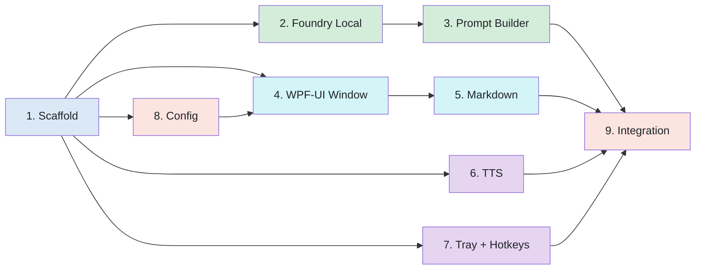

# Implementation Plan: TLDR

## Progress Tracker

| #   | Phase                         | Status      | Tasks  | Done   |
| --- | ----------------------------- | ----------- | ------ | ------ |
| 1   | Project Scaffolding           | Done        | 8      | 8      |
| 2   | Foundry Local Integration     | Done        | 5      | 5      |
| 3   | Prompt Builder                | Done        | 4      | 4      |
| 4   | WPF-UI Window (Mode-Shifting) | Done        | 13     | 13     |
| 5   | Markdown Rendering (WebView2) | Done        | 6      | 6      |
| 6   | Text-to-Speech                | Done        | 6      | 6      |
| 7   | System Tray + Hotkeys         | Not Started | 5      | 0      |
| 8   | Configuration                 | Not Started | 4      | 0      |
| 9   | Integration + Polish          | Not Started | 7      | 0      |
|     | **Total**                     |             | **58** | **42** |

## Phase 1: Project Scaffolding

Set up the solution, project file, NuGet feeds, and build verification.

- [x] 1.1 Create `Tldr.sln` and `src/Tldr/Tldr.csproj` as a .NET 9 WPF project
- [x] 1.2 Create `nuget.config` with nuget.org + ORT Azure DevOps feed
- [x] 1.3 Add NuGet package references: `Microsoft.AI.Foundry.Local.WinML`, `WPF-UI`, `Microsoft.Web.WebView2`, `Markdig`, `NAudio`, `System.Speech`, `Microsoft.Extensions.Configuration.Json`, `Microsoft.Extensions.Logging`, `DocumentFormat.OpenXml`, `UglyToad.PdfPig`
- [x] 1.4 Create `appsettings.json` with default config (model, voice, hotkeys, window, summarization defaults)
- [x] 1.5 Create placeholder `assets/icon.ico` and `assets/output.html` (WebView2 template)
- [x] 1.6 Create `prompts.json` with initial prompt fragments (base preamble, style variants, detail levels, tones)
- [x] 1.7 Create MIT `LICENSE` file at repo root
- [x] 1.8 Verify `dotnet build` succeeds with all packages restored

**Exit criteria**: `dotnet build` passes. All NuGet packages resolve. Solution opens in VS / VS Code.

## Phase 2: Foundry Local Integration

Get the LLM running and producing summaries from plain text input.

- [x] 2.1 Create `Summarizer.cs`: initialize `FoundryLocalManager`, catalog, and model download/load
- [x] 2.2 Implement `SummarizeAsync(string text, string systemPrompt, CancellationToken ct)` returning the full summary string
- [x] 2.3 Query model metadata at load time to read actual context window size; log it; store for runtime token checks
- [x] 2.4 Add token estimation (`text.Length / 4`) and guard: reject input exceeding context window with a user-friendly message (map-reduce is v0.3)
- [x] 2.5 Write a console smoke test: hardcode a paragraph, call `SummarizeAsync`, print the result. Verify model downloads and inference runs.

**Exit criteria**: Running the smoke test downloads Phi-4 Mini on first run, loads the model, and prints a coherent summary to console.

## Phase 3: Prompt Builder

Map UI options (style, detail, tone) to system prompts sent to the LLM. All prompts optimized for Phi-4 Mini per Microsoft's model card: short and direct, explicit format instructions, temperature 0.0, max output 4,096 tokens, compression only (never add knowledge).

- [x] 3.1 Create `prompts.json` at project root with all prompt fragments organized by category: `base` (shared preamble, ~50 tokens), `style` (Bullets, List, Table, Prose, Same), `detail` (Brief, Standard, Detailed), `tone` (Neutral, Formal, Casual). Each fragment is a short, direct instruction optimized for Phi-4 Mini. Combined system prompt must stay under ~200 tokens.
- [x] 3.2 Create `PromptBuilder.cs` with enums (`SummaryStyle { Bullets, List, Table, Prose, Same }`, `DetailLevel { Brief, Standard, Detailed }`, `Tone { Neutral, Formal, Casual }`) that loads `prompts.json` at startup and assembles a system prompt by concatenating base + style + detail + tone fragments
- [x] 3.3 Validate prompt file on load: ensure all enum keys have a matching entry in `prompts.json`; throw a clear error if a fragment is missing
- [x] 3.4 Wire `PromptBuilder` into `Summarizer.SummarizeAsync` so the assembled system prompt is passed to the LLM chat request with temperature 0.0

**Prompt design rules** (from Microsoft Phi-4 Mini documentation):
- System prompt fragments must be short and imperative ("Summarize as...", not "You are a helpful assistant that...")
- Always state the output format explicitly ("Return a markdown bullet list")
- Always state a target length ("~20% of original length" or "Maximum 300 words")
- Never ask the model to infer, add, or create information beyond the input
- One task per prompt (summarization only, not summarization + translation)
- Reference: [Phi-4 Mini Model Card](https://huggingface.co/microsoft/Phi-4-mini-instruct)

**Exit criteria**: Changing style/detail/tone produces visibly different summary outputs (bullets vs table vs paragraph, short vs long). Combined system prompt is under 200 tokens for all option combinations.

## Phase 4: WPF-UI Window (Mode-Shifting Card)

Build the Fluent Design window with four visual states: Ready → Loaded → Result → Reading. WPF-UI provides Mica backdrop, custom chrome, and modern controls. No dropdowns: pill toggles for style, slider for detail.

- [x] 4.1 Create `App.xaml` / `App.xaml.cs`: WPF-UI `ApplicationHost`, `FluentWindow` base, Mica backdrop, system theme detection (dark/light), single-instance enforcement (Mutex)
- [x] 4.2 Create `MainWindow.xaml` as `FluentWindow`: custom chrome with pin button (⊙), minimize, close; `ContentControl` bound to current state; 480x640 default, resizable, remembers position
- [x] 4.3 Implement `AppState` enum (`Ready`, `Loaded`, `Result`, `Reading`) and state machine property; `ContentControl.ContentTemplate` switches via `DataTrigger` on state changes
- [x] 4.4 **Ready state**: centered invitation text ("Paste or drop a file. I'll distill it."), keyboard hint, clipboard listener that transitions to Loaded on paste, drag-and-drop target for PDF/DOCX/TXT files
- [x] 4.5 **Loaded state**: collapsed text preview (2-3 lines + word count badge), pill toggle bar for style (Bullets / List / Table / Prose / Same), detail slider (Brief ← Standard → Full), Distill button
- [x] 4.6 **Result state**: collapsed input (▸ expand toggle), WebView2 output panel filling the card, action bar (Copy, Re-distill, Read Aloud), back arrow (↩) returning to Loaded
- [x] 4.7 **Reading state**: waveform playback strip sliding up from bottom (NAudio samples → WPF canvas), Pause / Stop / speed (1.0×) controls, sentence highlighting in WebView2 via `ExecuteScriptAsync`
- [x] 4.8 **Settings flyout**: gear icon in status bar triggers `Popup` with tone, theme toggle (System/Dark/Light)
- [x] 4.9 State transition animations: deferred to polish pass (4-state visibility binding works cleanly)
- [x] 4.10 Wire actions: Distill → `Summarizer.SummarizeAsync` on background thread (show spinner in Distill button), Copy → dual clipboard (HTML rich text + plain text), Re-distill → return to Loaded preserving input
- [x] 4.11 Create `FileExtractor.cs`: extract plain text from dropped PDF (`UglyToad.PdfPig`), DOCX (`DocumentFormat.OpenXml`), and TXT files; wire to Ready state drop handler
- [x] 4.12 Accessibility: `AutomationProperties.Name` on all interactive controls, tab order follows visual layout, screen-reader compatible
- [x] 4.13 Persist last-used style, detail, and tone to `%APPDATA%/Tldr/settings.json`; restore on next launch via `UserSettings.cs`

**Exit criteria**: Window opens with Mica backdrop. Pasting text or dropping a file transitions to Loaded state. Pill toggles and slider are functional. Distill produces output in Result state. Copy puts both HTML and plain text on clipboard. Back arrow returns to Loaded. All controls keyboard-navigable. Settings flyout opens/closes.

## Phase 5: Markdown Rendering (WebView2)

Render LLM markdown output as styled HTML in the output panel.

- [x] 5.1 Create `assets/output.html`: minimal HTML template with CSS for markdown elements (headings, lists, tables, code blocks, bold/italic). Clean, readable typography.
- [x] 5.2 Create `MarkdownRenderer.cs`: use Markdig to convert markdown string to HTML fragment
- [x] 5.3 Implement WebView2 initialization in MainWindow: load `output.html` template on startup, inject rendered HTML into the page via `ExecuteScriptAsync` when summary is ready
- [x] 5.4 Handle edge cases: empty output, very long output (scrollable), special characters in HTML (XSS-safe via Markdig's HTML encoding)
- [x] 5.5 Style output to follow WPF-UI theme: `setTheme()` JS function injects forced dark/light via `data-theme` attribute; system mode uses `prefers-color-scheme` media query
- [x] 5.6 Add sentence-level markup: `AddSentenceMarkers()` wraps each `<li>`, `
`, `<tr>` with `data-sentence="N"` attributes; `highlightSentence(n)` and `clearHighlight()` JS functions for TTS sync

**Exit criteria**: LLM markdown output renders correctly, follows system dark/light theme, and sentence spans are addressable for highlighting.

## Phase 6: Text-to-Speech

Read the summary aloud with neural voices, with stop/control capability.

- [x] 6.1 Create `SapiTtsEngine.cs` with `SpeakAsync(string text, string voice, float rate, CancellationToken ct)` and `Stop()` methods using System.Speech SAPI5
- [x] 6.2 Sentence-by-sentence playback: splits summary into lines, speaks each sequentially with `SentenceReached(n)` event for WebView2 highlighting
- [x] 6.3 Audio playback via SAPI5 SpeechSynthesizer with configurable voice and rate
- [x] 6.4 SAPI5 is the primary engine (offline, legal, reliable); Edge neural TTS deferred to future enhancement
- [x] 6.5 Wire Read Aloud button → `ReadAloudAsync()`, Pause/Stop → `PauseTts()`/`StopTts()`, auto-return to Result on finish
- [x] 6.6 Sentence highlighting: `SentenceHighlightRequested`/`Cleared` events bridge ViewModel to WebView2 `highlightSentence(n)`/`clearHighlight()` JS calls

**Exit criteria**: Clicking Read Aloud transitions to Reading state with waveform strip. Current sentence highlights in sync. Pause/Stop work. Offline fallback works with SAPI5.

## Phase 7: System Tray + Hotkeys

Tray icon persistence and global hotkey registration.

- [ ] 7.1 Create `TrayIconManager.cs`: set up `NotifyIcon` with icon from `assets/icon.ico`, context menu (Open, Exit)
- [ ] 7.2 Implement minimize-to-tray: override `MainWindow.OnClosing` to hide window instead of exit; tray context menu "Exit" calls `Application.Shutdown()`
- [ ] 7.3 Create `HotkeyManager.cs`: P/Invoke `RegisterHotKey` / `UnregisterHotKey`; register `Ctrl+Shift+S` (open window) and `Ctrl+Shift+X` (stop reading)
- [ ] 7.4 Wire hotkey messages: `Ctrl+Shift+S` shows/focuses window (and optionally pastes clipboard); `Ctrl+Shift+X` calls `TextToSpeech.Stop()`
- [ ] 7.5 Handle hotkey conflicts: if registration fails (key already taken), log a warning and show a toast notification

**Exit criteria**: App lives in tray when window is closed. Hotkeys work globally to open the window and stop playback. Double-click tray icon opens window.

## Phase 8: Configuration

Load and apply settings from `appsettings.json`.

- [ ] 8.1 Create `Config.cs`: strongly-typed configuration classes matching the JSON structure (HotkeyConfig, LlmConfig, SummarizationConfig, TtsConfig, WindowConfig)
- [ ] 8.2 Load config at startup via `Microsoft.Extensions.Configuration.Json` and bind to the typed classes
- [ ] 8.3 Apply config values: default pill toggle selection (style), slider position (detail), hotkey registration (configurable keys), window size (480x640 default), voice, theme, model alias. Restore last-used style/detail from persisted config.
- [ ] 8.4 Add `appsettings.json` to `.gitignore` (user secrets); ship `appsettings.default.json` as the template

**Exit criteria**: Changing values in `appsettings.json` and restarting the app applies the new settings. Last-used style and detail survive restart.

## Phase 9: Integration + Polish

End-to-end flow verification, error handling, and release prep.

- [ ] 9.1 End-to-end test: open via hotkey → Ready state → paste article → Loaded state → select Bullets + drag slider to Brief → Distill → Result state → Copy (verify HTML + plain text on clipboard) → Read Aloud → Reading state (waveform + sentence highlight) → Stop → Result state → Re-distill → Loaded state → close to tray → re-open via hotkey. Also test: drop PDF file → Loaded state with extracted text.
- [ ] 9.2 Error handling: model download failure (show retry in Ready state), empty input (stay in Ready state), unsupported file type (toast notification), TTS failure (show toast, stay in Result state), hotkey conflict (user notification)
- [ ] 9.3 First-run experience: if model not yet downloaded, show progress bar in Ready state ("Downloading Phi-4 Mini: 45%...")
- [ ] 9.4 Accessibility audit: tab through all controls with keyboard only, verify screen reader announcements, test high contrast mode
- [ ] 9.5 Create `.gitignore` (bin/, obj/, appsettings.json, *.user, .vs/)
- [ ] 9.5 Update `plan.md` Decisions table with any changes discovered during implementation
- [ ] 9.6 Verify `dotnet publish -c Release` produces a working self-contained executable

**Exit criteria**: Full flow works end-to-end. App handles errors gracefully. Clean build with no warnings. Self-contained publish runs on a clean machine (no .NET pre-installed).

## Implementation Order

**Critical path**: Phase 1 → Phase 2 → Phase 3 → Phase 9

**Parallel tracks after Phase 1**:

- Track A (LLM): Phase 2 → Phase 3
- Track B (UI): Phase 8 → Phase 4 → Phase 5
- Track C (Audio): Phase 6
- Track D (System): Phase 7

All tracks converge at Phase 9 (Integration).

## Risk Register

| Risk                                     | Impact | Likelihood | Mitigation                                                           |
| ---------------------------------------- | ------ | ---------- | -------------------------------------------------------------------- |
| Foundry Local ONNX context window < 128k | High   | Medium     | Query metadata at load. Fall back to Phi-3 Mini 128k if needed       |
| WinML NuGet package version instability  | Medium | Medium     | Pin version 0.9.0. Test build before each session                    |
| WebView2 runtime not installed           | Medium | Low        | WebView2 Evergreen is on most Win10/11 machines. Add bootstrap check |
| Edge TTS service protocol changes        | Low    | Low        | System.Speech fallback always available. Edge TTS is stable          |
| NAudio MP3 streaming issues              | Medium | Low        | Fall back to writing temp WAV file + SoundPlayer                     |
| Hotkey conflicts with other apps         | Low    | Medium     | Graceful fallback with user notification. Configurable keys          |
| WPF-UI breaking changes (pre-1.0 API)    | Medium | Low        | Pin version in .csproj. Mica/chrome are stable features              |
