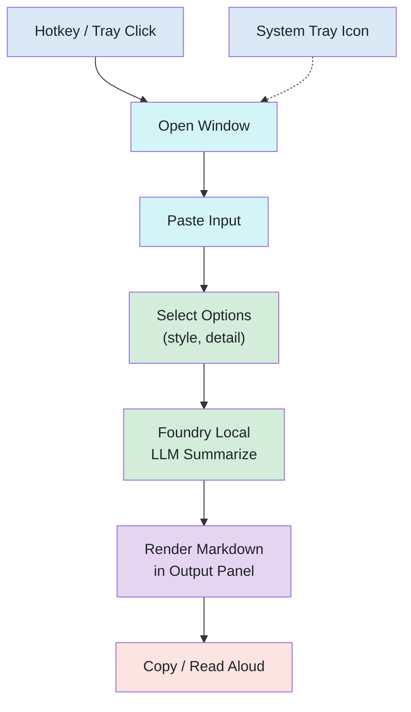
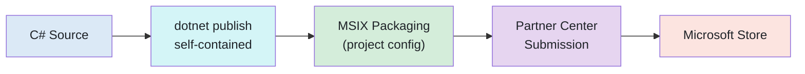

# TLDR: Local-Only Text Summarizer + TTS

## North Star

Build the fastest, most private text summarizer on Windows: paste anything, get the gist, hear it read aloud. Zero cloud, zero compromise.

### Principles

| #   | Principle                  | Rationale                                                                                                                                                                                                                                            |
| --- | -------------------------- | ---------------------------------------------------------------------------------------------------------------------------------------------------------------------------------------------------------------------------------------------------- |
| 1   | **Docs-first development** | We use bleeding-edge, potentially unstable libraries (Foundry Local SDK, ORT-Nightly). Always verify against official GitHub samples and API reference before writing integration code. Never trust cached knowledge or NuGet README examples alone. |
| 2   | **Local-only privacy**     | No data leaves the machine. No cloud APIs, no telemetry phoning home.                                                                                                                                                                                |
| 3   | **One-paste simplicity**   | Paste or drop, pick style, hit Distill. Three interactions max.                                                                                                                                                                                      |
| 4   | **Portable Core**          | Business logic in Core/ with no platform dependencies. Windows specifics stay in Platform/.                                                                                                                                                          |

## Problem

iOS Shortcuts can summarize clipboard content and read it aloud. No equivalent exists on Windows as a lightweight, always-ready, privacy-first tool.

## Solution

A C# (.NET 9) Windows app with a compact windowed UI that summarizes pasted content via a **local LLM** (Microsoft Foundry Local), renders the output as formatted markdown, and reads it aloud. Opens from a global hotkey or system tray icon. No cloud, no API keys, no data leaves the machine.

## Architecture



## Core Flow

1. User presses hotkey (`Ctrl+Shift+S`) or clicks the tray icon
2. Window opens in Ready state (invitation text on Mica backdrop)
3. User pastes content or drops a file (transitions to Loaded state with preview and options)
4. User selects style (pill toggles) and detail level (slider)
5. Clicks "Distill" (or `Enter`)
6. App sends text + style prompt to local LLM
7. Result state renders the summary as formatted markdown (WebView2)
8. User can: copy summary to clipboard, read it aloud, adjust voice, or re-distill with different options

## Target Hardware

AMD Ryzen 7 PRO 7840U, Radeon 780M iGPU, AMD XDNA NPU (~10 TOPS), 64 GB RAM.
No NVIDIA GPU (CUDA/TensorRT unavailable). Not Copilot+ (NPU < 40 TOPS, Phi Silica ineligible).
Foundry Local will use **CPU (Generic)** or **NPU (AMD Vitis AI)** variants.

## Technology Stack

### Summarization: Microsoft Foundry Local (Self-Contained SDK)

Foundry Local runs LLMs on-device via a self-contained C# SDK. No CLI install, no REST server, no external service. The `Microsoft.AI.Foundry.Local.WinML` NuGet package bundles the native runtime (<20 MB) and runs inference in-process.

```csharp
using Microsoft.AI.Foundry.Local;

var config = new Configuration
{
    AppName = "Tldr",
    LogLevel = Microsoft.AI.Foundry.Local.LogLevel.Information
};

await FoundryLocalManager.CreateAsync(config, logger);
var mgr = FoundryLocalManager.Instance;

var catalog = await mgr.GetCatalogAsync();
var model = await catalog.GetModelAsync("phi-4-mini")
    ?? throw new Exception("Model not found");

await model.DownloadAsync(p => Console.Write($"\rDownloading: {p:F2}%"));
await model.LoadAsync();

var chatClient = await model.GetChatClientAsync();
var messages = new List<ChatMessage>
{
    new() { Role = "user", Content = $"Summarize: {text}" }
};
var response = chatClient.CompleteChatStreamingAsync(messages, ct);
```

**Why Foundry Local over Ollama**: auto hardware acceleration (NPU > GPU > CPU), Microsoft-managed model catalog, self-contained SDK (no external install), native in-process inference, shared model cache across apps.

### TTS: Edge Speech Service + System.Speech fallback

| Engine                               | Pros                                        | Cons              |
| ------------------------------------ | ------------------------------------------- | ----------------- |
| **Edge speech service** (primary)    | Free, natural neural voices, many languages | Requires internet |
| **System.Speech / SAPI5** (fallback) | Fully offline, built-in .NET                | Robotic sound     |

Default voice: `en-US-AriaNeural` (conversational). Configurable in settings.
Edge speech service called via WebSocket (same protocol as `edge-tts` npm/pip package; sends SSML, receives MP3 chunks).

### UI Framework: WPF + WebView2 + WPF-UI (Fluent Design)

**Design philosophy: "Distill, don't configure."** The window presents one thing at a time: input, options, or output. Controls appear when relevant and recede when not. The result is a tool that feels like a thought partner, not a settings form.

WPF provides the MVVM foundation and MSIX packaging. **WPF-UI** (Lepo) layers Windows 11 Fluent Design on top: Mica backdrop, custom chrome with snap layouts, modern control styles, and automatic dark/light theming. WebView2 renders LLM markdown output as formatted HTML.

| Component          | Library / API                                      | Why                                                         |
| ------------------ | -------------------------------------------------- | ----------------------------------------------------------- |
| Window framework   | WPF (.NET 9) + WPF-UI (Fluent Design)              | Mica backdrop, custom chrome, modern controls, theme system |
| Markdown rendering | WebView2 + Markdig (C# markdown → HTML)            | Rich formatted output: tables, lists, bold, code, headings  |
| System tray        | `NotifyIcon` (WinForms interop) or Hardcodet       | Tray icon persists when window is closed                    |
| Global hotkey      | `RegisterHotKey` Win32 API (P/Invoke)              | Works globally, no admin elevation required                 |
| Clipboard          | `Clipboard.GetText()` (WPF)                        | Built-in, Unicode support                                   |
| File parsing       | `DocumentFormat.OpenXml` + `UglyToad.PdfPig`       | Extract plain text from dropped DOCX and PDF files          |
| Audio playback     | `NAudio`                                           | MP3 streaming + waveform data extraction for visualization  |
| State transitions  | WPF Storyboard + ContentControl                    | Smooth 200ms ease-out mode shifts between UI states         |
| Notifications      | Windows Community Toolkit / AppNotificationManager | Toast for background events (tray mode)                     |

### Window Layout

The window is a mode-shifting card. Instead of showing all controls at once, the content area transforms between four visual states. Controls appear when relevant and animate away when not. No dropdowns: style is pill toggles, detail is a slider.

#### State 1: Ready (empty)

```
╭──────────────────────────────────────────────────╮
│                                         ⊙  —  ×  │
│                                                  │
│                                                  │
│                                                  │
│        Paste or drop a file.                     │
│        I'll distill it.                          │
│                                                  │
│        Ctrl+V to paste  ·  drop PDF/DOCX/TXT     │
│                                                  │
│                                                  │
│                                                  │
╰──────────────────────────────────────────────────╯
```

Just a prompt on Mica. No chrome, no controls. The window IS the invitation. Accepts paste (`Ctrl+V`) or file drag-and-drop (PDF, DOCX, TXT). Dropped files are extracted to plain text before proceeding.

#### State 2: Loaded (text pasted)

```
╭──────────────────────────────────────────────────╮
│                                         ⊙  —  ×  │
│                                                  │
│  The Board of Directors met on Tuesday to...     │
│  discuss fiscal Q3 results. Revenue grew 12%...  │
│  ▼ 2,480 words                                   │
│                                                  │
│  (●) Bullets  ( ) List  ( ) Table  ( ) Prose     │
│  Brief ◁━━━━━━━━━●━━━━━━━━━━━━━━━━━━━━━▷ Full   │
│                                                  │
│                [ Distill  ⏎ ]                    │
│                                                  │
╰──────────────────────────────────────────────────╯
```

Input text shown as a collapsed 2-3 line preview with a word count badge. Options appear below as **pill toggles** (style) and a **slider** (detail level). Single primary action button.

#### State 3: Result

```
╭──────────────────────────────────────────────────╮
│  ↩                                      ⊙  —  ×  │
│                                                  │
│  ▸ The Board of Directors met on Tue...          │
│                                                  │
│  • Revenue grew 12% YoY to $4.2B                │
│  • Operating margin expanded 3 points            │
│  • Cloud division surpassed $1B ARR              │
│  • Board approved $500M share buyback            │
│  • Next earnings call: October 28                │
│                                                  │
│  ┈┈┈┈┈┈┈┈┈┈┈┈┈┈┈┈┈┈┈┈┈┈┈┈┈┈┈┈┈┈┈┈┈┈┈┈┈┈┈┈┈┈  │
│  Copy             ↻ Re-distill      Read Aloud   │
╰──────────────────────────────────────────────────╯
```

Input collapses to a one-line preview (▸ clickable to expand). Back arrow (↩) returns to input with options. Output fills the card. Action bar at the bottom: Copy, Re-distill (reopen options), Read Aloud.

#### State 4: Reading

```
╭──────────────────────────────────────────────────╮
│  ↩                                      ⊙  —  ×  │
│                                                  │
│  ▸ The Board of Directors met on Tue...          │
│                                                  │
│  • Revenue grew 12% YoY to $4.2B                │
│  • ► Operating margin expanded 3 points ◄       │
│  • Cloud division surpassed $1B ARR              │
│  • Board approved $500M share buyback            │
│  • Next earnings call: October 28                │
│                                                  │
│  ╔════════════════════════════════════════════╗   │
│  ║ ▁▂▃▅▇▅▃▁▂▃▅▇▅▃▁▂▃    ⏸  ■    1.0×  ▾  ║   │
│  ╚════════════════════════════════════════════╝   │
╰──────────────────────────────────────────────────╯
```

Current sentence highlighted (► ◄ accent markers) in the rendered output. Waveform playback strip slides up from the bottom with Pause, Stop, and speed controls. Voice selection lives in a settings flyout (gear icon), not in the main layout.

#### Design Tokens

| Token         | Value                                   | Note                                                   |
| ------------- | --------------------------------------- | ------------------------------------------------------ |
| Backdrop      | Mica (Windows 11)                       | Falls back to solid dark (#1e1e2e) on Windows 10       |
| Theme         | Dark (default), Light                   | Respects Windows system theme; toggle in settings      |
| Accent        | System accent color                     | User's Windows personalization; pill/button highlights |
| Font          | Segoe UI Variable                       | Windows 11 native; falls back to Segoe UI              |
| Code font     | Cascadia Code                           | Monospace for code blocks in rendered output           |
| Corner radius | 8px (window), 16px (pills), 4px (cards) | Matches Windows 11 design language                     |
| Spacing       | 8px grid                                | All margins and padding are multiples of 8             |
| Transition    | 200ms ease-out                          | Mode shifts, control reveal/hide, waveform appear      |

### Summarization Options

Style and detail are presented as pill toggles and a slider (no dropdowns). Tone and language are in the settings flyout accessed via gear icon.

| Option       | Control     | Values                                                  | Default     |
| ------------ | ----------- | ------------------------------------------------------- | ----------- |
| **Style**    | Pill toggle | Bullets, List, Table, Prose, Same                       | Bullets     |
| **Detail**   | Slider      | Brief (~20%) ← Standard (~35%) → Detailed (~50%)        | Standard    |
| **Tone**     | Settings    | Neutral, Formal, Casual                                 | Neutral     |
| **Language** | Settings    | Auto-detect, English, Portuguese, Spanish, French, etc. | Auto-detect |

Each option maps to a prompt modifier appended to the base system prompt. For example:

- **Bullet Points + Brief**: "Summarize as a short bullet-point list (~20% of original length). Be direct."
- **Table + Detailed**: "Summarize in a markdown table with columns: Topic, Key Points, Action Items. Include 50% of original detail."
- **Same Format + Standard**: "Condense the text to ~35% of its length while preserving the same formatting style (paragraphs, headings, lists as in the original)."

### Prompt Engineering (Phi-4 Mini)

All prompts in `prompts.json` are optimized for Phi-4 Mini per Microsoft's model card and Phi Cookbook guidelines:

| Principle                    | Rationale                                                                            |
| ---------------------------- | ------------------------------------------------------------------------------------ |
| Short, direct system prompts | 3.8B parameter model has limited capacity; verbose prompts waste context and confuse |
| Explicit format instructions | "Return a markdown bullet list" not "You might consider using bullets"               |
| State output length          | "Maximum 500 words" or "~20% of original"; model respects length constraints well    |
| Temperature 0.0              | Microsoft examples use 0.0 for deterministic output; best for summarization          |
| Compression only             | Never ask the model to add knowledge; only compress/restructure what's given         |
| One task per prompt          | Don't combine summarization + translation + formatting in a single instruction       |
| Markdown native              | Model generates markdown naturally; request specific markdown elements directly      |
| Max output 4,096 tokens      | Hard limit from model architecture; prompts must request concise output within this  |

Prompt template assembly: `base` + `style` + `detail` + `tone` fragments concatenated into a single system message. The combined system prompt should stay under ~200 tokens to maximize input space for the document.

Reference: [Phi-4 Mini Model Card](https://huggingface.co/microsoft/Phi-4-mini-instruct), [Phi Cookbook](https://github.com/microsoft/PhiCookBook)

### Window Behavior

| Behavior               | Detail                                                                                   |
| ---------------------- | ---------------------------------------------------------------------------------------- |
| Open trigger           | Hotkey (`Ctrl+Shift+S`) or tray icon click                                               |
| Initial state          | Ready (empty) if clipboard is empty; Loaded (text pasted) if auto-paste is on            |
| Close behavior         | Minimize to tray (not exit). `X` hides the window; right-click tray → Exit to quit       |
| Auto-paste on open     | Configurable: reads clipboard and transitions directly to Loaded state (no auto-distill) |
| State machine          | Ready → Loaded → Result → Reading. Back arrow (↩) returns to Loaded from Result          |
| Streaming output       | LLM tokens appear in output panel as generated (WebView2 DOM updates in Result state)    |
| Re-distill             | ↻ button in Result state reopens Loaded state with options, preserving input             |
| Keyboard shortcuts     | `Enter` or `Ctrl+Enter` = Distill, `Ctrl+C` on output = Copy, `Ctrl+R` = Read Aloud      |
| Window size            | Default 480x640 (compact card), resizable, remembers last position                       |
| Always on top (toggle) | ⊙ pin button in custom title bar                                                         |
| Settings flyout        | Gear icon opens flyout for: Tone, Language, Voice, Rate, Theme, auto-paste toggle        |
| Settings persistence   | Last-used style pill and detail slider position saved to config; restored on next launch |

## Foundry Local Model Catalog (This Hardware)

*Verified 2026-04-08 via `foundry model list` (Foundry Local CLI).*

19 chat model aliases, all supported on this hardware. Two task types: **chat** (text generation) and **audio** (speech-to-text via Whisper). No multimodal or vision models in catalog; all chat models are text-only input/output.

### Recommended for Summarization

| Model                    | Alias                  | Size   | Context | Max Pages | NPU (Vitis)  | Best for                                                                    |
| ------------------------ | ---------------------- | ------ | ------- | --------- | ------------ | --------------------------------------------------------------------------- |
| **Phi-4 Mini**           | `phi-4-mini`           | 3.6 GB | 128,000 | ~382      | Yes          | **MVP default**. Best quality/speed ratio. Supports tool calling.           |
| **Phi-4 Mini Reasoning** | `phi-4-mini-reasoning` | 2.8 GB | 128,000 | ~382      | Yes          | Structured output (bullet points, action items)                             |
| **Qwen 2.5 0.5B**        | `qwen2.5-0.5b`         | 0.5 GB | 32,768  | ~96       | Yes          | "Instant mode". Near-instant, acceptable for emails. Supports tool calling. |
| **Phi-3 Mini 128k**      | `phi-3-mini-128k`      | 2.1 GB | 131,072 | ~391      | Yes          | Long documents (meeting transcripts)                                        |
| **Qwen 2.5 7B**          | `qwen2.5-7b`           | 5.2 GB | 131,072 | ~391      | Yes          | Multilingual summarization. Supports tool calling.                          |
| **Phi-4**                | `phi-4`                | 8.4 GB | 16,384  | ~47       | No (GPU/CPU) | Highest quality when speed is not critical                                  |

Max Pages = usable input tokens (context - ~650 reserved for prompt + output) / ~333 tokens per page (250 words).

### All Supported Models

| Model                | Alias                  | Size     | Context | Tasks       | NPU (Vitis) | GPU | CPU | Notes                          |
| -------------------- | ---------------------- | -------- | ------- | ----------- | ----------- | --- | --- | ------------------------------ |
| Phi-4 Mini           | `phi-4-mini`           | 3.60 GB  | 128,000 | chat, tools | Yes         | Yes | Yes | Flagship small model           |
| Phi-4 Mini Reasoning | `phi-4-mini-reasoning` | 2.78 GB  | 128,000 | chat        | Yes         | Yes | Yes | Structured output focus        |
| Phi-4                | `phi-4`                | 8.37 GB  | 16,384  | chat        | No          | Yes | Yes | Highest Phi quality, slower    |
| Phi-3.5 Mini         | `phi-3.5-mini`         | 2.16 GB  | 128,000 | chat        | No          | Yes | Yes | Proven, fast on CPU, older gen |
| Phi-3 Mini 128k      | `phi-3-mini-128k`      | 2.13 GB  | 131,072 | chat        | Yes         | Yes | Yes | 128k context for long docs     |
| Phi-3 Mini 4k        | `phi-3-mini-4k`        | 2.13 GB  | 4,096   | chat        | Yes         | Yes | Yes | 4k context, slightly faster    |
| GPT-OSS 20B          | `gpt-oss-20b`          | 11.78 GB | 8,192   | chat        | No          | Yes | Yes | Largest model in catalog       |
| Qwen 2.5 14B         | `qwen2.5-14b`          | 9.30 GB  | 131,072 | chat, tools | No          | Yes | Yes | High quality, slow             |
| Qwen 2.5 7B          | `qwen2.5-7b`           | 5.20 GB  | 131,072 | chat, tools | Yes         | Yes | Yes | Multilingual strength          |
| Qwen 2.5 1.5B        | `qwen2.5-1.5b`         | 1.51 GB  | 32,768  | chat, tools | No          | Yes | Yes | Decent quality, no Vitis       |
| Qwen 2.5 0.5B        | `qwen2.5-0.5b`         | 0.52 GB  | 32,768  | chat, tools | Yes         | Yes | Yes | Ultra-light, near-instant      |
| Qwen3 0.6B           | `qwen3-0.6b`           | 0.58 GB  | 32,768  | chat, tools | No          | No  | Yes | Latest gen, CPU only           |
| Qwen 2.5 Coder 14B   | `qwen2.5-coder-14b`    | 8.79 GB  | 131,072 | chat, tools | No          | Yes | Yes | Code-optimized, not for text   |
| Qwen 2.5 Coder 7B    | `qwen2.5-coder-7b`     | 4.73 GB  | 131,072 | chat, tools | Yes         | Yes | Yes | Code-optimized, not for text   |
| Qwen 2.5 Coder 1.5B  | `qwen2.5-coder-1.5b`   | 1.25 GB  | 32,768  | chat, tools | Yes         | Yes | Yes | Code-optimized, not for text   |
| Qwen 2.5 Coder 0.5B  | `qwen2.5-coder-0.5b`   | 0.52 GB  | 32,768  | chat, tools | Yes         | Yes | Yes | Code-optimized, not for text   |
| DeepSeek R1 7B       | `deepseek-r1-7b`       | 5.58 GB  | 65,536  | chat        | Yes         | Yes | Yes | Strong reasoning, adds latency |
| DeepSeek R1 14B      | `deepseek-r1-14b`      | 10.27 GB | 65,536  | chat        | No          | Yes | Yes | Best reasoning, slow           |
| Mistral 7B v0.2      | `mistral-7b-v0.2`      | 4.07 GB  | 32,768  | chat        | Yes         | Yes | Yes | Good instruction following     |

### Whisper Models (future: voice input)

Not listed by `foundry model list` CLI but accessible via SDK per [official docs](https://learn.microsoft.com/en-us/azure/foundry-local/what-is-foundry-local#supported-capabilities) and GitHub README.

| Model         | Alias           | Notes                           |
| ------------- | --------------- | ------------------------------- |
| Whisper Tiny  | `whisper-tiny`  | Fastest, lower accuracy         |
| Whisper Base  | `whisper-base`  | Good for short audio            |
| Whisper Small | `whisper-small` | Good accuracy, reasonable speed |

### Document Size Limits

Practical max document size depends on context window, prompt overhead (~150 tokens), and output reserve (~500 tokens). Approximation: 1 token ≈ 4 characters ≈ 0.75 words.

#### Speed Estimates (AMD Ryzen 7 PRO 7840U)

| Input Size | Tokens  | CPU (~100 tok/s) | NPU (~300 tok/s) |
| ---------- | ------- | ---------------- | ---------------- |
| 10 pages   | ~3,300  | 33 sec           | 11 sec           |
| 50 pages   | ~16,500 | 2.8 min          | 55 sec           |
| 100 pages  | ~33,000 | 5.5 min          | 1.8 min          |
| 382 pages  | ~127k   | 21 min           | 7 min            |

Sweet spot: under ~50 pages (< 1 min on NPU). Above that, user should see a progress indicator.

#### Large Document Strategies

| Strategy            | Max Size       | Quality                          | Speed              | Complexity |
| ------------------- | -------------- | -------------------------------- | ------------------ | ---------- |
| **Single-pass**     | Context window | Best                             | Varies with size   | Simple     |
| **Map-Reduce**      | Unlimited      | Good (loses cross-chunk context) | Parallel-friendly  | Medium     |
| **Hierarchical**    | Unlimited      | Better than map-reduce           | Slower (2+ passes) | Higher     |
| **Rolling summary** | Unlimited      | Degrades over length             | Sequential, slow   | Medium     |

**Single-pass**: Send entire document + system prompt to the model in one request. Best quality because the model sees all context at once. Only works when the document fits within the context window minus prompt and output tokens.

```
tokens = estimate(text)
if tokens <= contextWindow - 650:
    summary = summarize(text)
```

**Map-Reduce**: Split document into N chunks. Summarize each chunk independently (the "map" step). Concatenate all chunk summaries and summarize the combined result (the "reduce" step). Loses cross-chunk context (e.g., a conclusion that references the intro) but handles unlimited size. Chunk summaries could run in parallel if the runtime supports concurrent inference.

```
chunks = split(text, chunkSize = contextWindow * 0.75)
chunkSummaries = chunks.Select(c => summarize(c))
combined = string.Join("\n\n", chunkSummaries)
finalSummary = summarize(combined)
```

**Hierarchical**: Like map-reduce but with multiple reduction layers. If the combined chunk summaries still exceed the context window, recursively chunk and summarize again until the result fits in a single pass. Better quality than flat map-reduce for very large documents (500+ pages) because each layer preserves more structure.

```
summaries = chunks.Select(c => summarize(c))
while estimate(summaries) > contextWindow - 650:
    summaries = split(summaries, chunkSize).Select(g => summarize(g))
finalSummary = summarize(join(summaries))
```

**Rolling summary**: Process the document sequentially. Summarize chunk 1, then feed (summary of chunk 1 + chunk 2) into the next call, accumulating context as you go. Preserves narrative flow better than map-reduce for early sections, but quality degrades as the rolling summary compresses more and more content. Strictly sequential, so no parallelism possible.

```
rolling = ""
for chunk in chunks:
    rolling = summarize(rolling + "\n\n" + chunk)
finalSummary = rolling
```

#### Strategy Selection Logic (Runtime)

```
inputTokens = text.Length / 4
maxInput = model.ContextWindow - 650

if inputTokens <= maxInput:
    use Single-pass
else if inputTokens <= maxInput * 10:
    use Map-Reduce (one reduce step is enough)
else:
    use Hierarchical (reduce step itself needs chunking)
```

Rolling summary is not used by default (quality degrades). Available as a user-selectable option for ordered narratives where preserving sequence matters more than compression quality.

#### Chunking Rules

| Rule                   | Value                                                            | Rationale                                                      |
| ---------------------- | ---------------------------------------------------------------- | -------------------------------------------------------------- |
| Chunk size             | 75% of context window                                            | Leaves room for system prompt (~150 tok) and output (~500 tok) |
| Chunk overlap          | 200 tokens (~150 words)                                          | Prevents losing context at split boundaries                    |
| Split priority         | Paragraph > sentence > word > char                               | Avoids mid-sentence breaks that confuse the model              |
| Min chunk size         | 500 tokens                                                       | Below this, chunks are too small for meaningful summarization  |
| Max chunks before warn | 20                                                               | Above 20 chunks, warn user about long processing time          |
| Reduce prompt          | "Combine these section summaries into a single coherent summary" | Explicit instruction for the reduce step                       |

#### MVP Approach

- Single-pass by default (Phi-4 Mini handles up to ~382 pages).
- Warn user above ~50 pages with estimated wait time.
- If input exceeds context window, fall back to map-reduce chunking automatically.
- Strategy selection is automatic based on token count (see logic above).
- Chunk at paragraph boundaries with 200-token overlap.
- Show progress: "Summarizing chunk 3 of 7..." in the toast notification.
- Token estimation: `text.Length / 4` (fast heuristic, no tokenizer dependency).
- Caveat: ONNX-quantized Foundry Local variants may have smaller effective context windows than the original models. Validate at runtime via model metadata.

## Feature Roadmap

### MVP (v0.1)

- [ ] WPF-UI Fluent window with Mica backdrop, custom chrome, four-state layout (Ready → Loaded → Result → Reading)
- [ ] Summarization options: style as pill toggles, detail as slider, tone/language in settings flyout
- [ ] Foundry Local SDK integration: single-pass summarization with Phi-4 Mini
- [ ] Markdown rendering via Markdig → WebView2 (tables, lists, bold, code blocks)
- [ ] Copy summary to clipboard: rich text (HTML) + plain text (markdown stripped) on clipboard simultaneously
- [ ] File drag-and-drop: accept PDF, DOCX, TXT files in Ready state; extract plain text via parsing libraries
- [ ] Read Aloud with sentence-level highlighting in output, waveform playback strip
- [ ] Accessibility: ARIA labels on WebView2 output, keyboard navigation for all controls, high contrast mode support
- [ ] Settings flyout: voice selector, speech rate, tone, language, theme toggle
- [ ] Remember last-used style and detail settings between sessions
- [ ] System tray icon with minimize-to-tray on close
- [ ] Global hotkey: open window (`Ctrl+Shift+S`), stop reading (`Ctrl+Shift+X`)
- [ ] `appsettings.json` config for model, voice, hotkeys, window behavior

### v0.2

- [ ] Streaming LLM output (tokens appear as they generate in Result state)
- [ ] Auto-paste clipboard content on open (transitions directly to Loaded state)
- [ ] Language auto-detection for multilingual TTS voice selection
- [ ] History: last N summaries accessible from sidebar or flyout
- [ ] Model switcher (e.g. fast mode with Qwen 0.5B vs quality mode with Phi-4 Mini)
- [ ] Keyboard shortcuts: `Enter` distill, `Ctrl+R` read aloud

### v0.3

- [ ] Map-reduce chunking for documents exceeding context window
- [ ] Always-on-top pin toggle
- [ ] Custom system prompts / saved presets
- [ ] Foundry Local auto-start and model preloading on app launch
- [ ] Startup with Windows (registry or Task Scheduler)
- [ ] MSIX packaging; sideload testing

## Project Structure

```
tldr/
├── src/
│   └── Tldr/
│       ├── Tldr.csproj              # .NET 9 WPF project, WPF-UI + WinML + WebView2 NuGet refs
│       ├── App.xaml / App.xaml.cs   # WPF-UI ApplicationHost, FluentWindow, Mica, single instance
│       ├── MainWindow.xaml          # Mode-shifting card: Ready → Loaded → Result → Reading states
│       ├── MainWindow.xaml.cs       # State machine, action wiring, code-behind
│       ├── Summarizer.cs            # Foundry Local SDK integration + prompt builder
│       ├── PromptBuilder.cs         # Loads prompts.json, assembles system prompt from options
│       ├── MarkdownRenderer.cs      # Markdig → HTML + WebView2 rendering
│       ├── TextToSpeech.cs          # Edge speech service + System.Speech fallback
│       ├── FileExtractor.cs         # PDF, DOCX, TXT text extraction for drag-and-drop
│       ├── HotkeyManager.cs         # RegisterHotKey P/Invoke wrapper
│       ├── TrayIconManager.cs       # NotifyIcon setup, minimize-to-tray behavior
│       └── Config.cs                # appsettings.json binding
├── assets/
│   ├── icon.ico                     # Tray and window icon
│   └── output.html                  # WebView2 template for markdown rendering
├── prompts.json                     # All LLM prompt templates (style, detail, tone fragments)
├── nuget.config                     # ORT package feed for Foundry Local
├── appsettings.json                 # User configuration
├── Tldr.sln
├── LICENSE                          # MIT
└── plan.md
```

## Configuration (appsettings.json)

```json
{
  "Hotkeys": {
    "OpenWindow": "Ctrl+Shift+S",
    "StopReading": "Ctrl+Shift+X"
  },
  "Llm": {
    "Model": "phi-4-mini",
    "MaxOutputTokens": 1024,
    "Temperature": 0.0
  },
  "Summarization": {
    "DefaultStyle": "Bullets",
    "DefaultDetail": "Standard",
    "DefaultTone": "Neutral"
  },
  "Tts": {
    "Engine": "edge",
    "Voice": "en-US-AriaNeural",
    "Rate": "Normal"
  },
  "Window": {
    "AutoPasteClipboard": true,
    "MinimizeToTray": true,
    "Width": 480,
    "Height": 640,
    "Theme": "System"
  }
}
```

## Dependencies

### NuGet Packages

| Package                                   | Version | Purpose                                       |
| ----------------------------------------- | ------- | --------------------------------------------- |
| `Microsoft.AI.Foundry.Local.WinML`        | 0.9.0   | Self-contained Foundry Local runtime          |
| `WPF-UI`                                  | 3.x     | Mica backdrop, Fluent controls, custom chrome |
| `Microsoft.Web.WebView2`                  | 1.x     | Chromium-based markdown output panel          |
| `Markdig`                                 | 0.37.x  | C# markdown → HTML conversion                 |
| `Microsoft.Extensions.Logging`            | 9.0.10  | Structured logging                            |
| `Microsoft.Extensions.Configuration.Json` | 9.0.x   | `appsettings.json` binding                    |
| `NAudio`                                  | 2.2.x   | MP3 streaming + waveform data for playback    |
| `System.Speech`                           | 9.0.x   | Offline SAPI5 TTS fallback                    |
| `DocumentFormat.OpenXml`                  | 3.x     | DOCX text extraction (drag-and-drop input)    |
| `UglyToad.PdfPig`                         | 0.4.x   | PDF text extraction (drag-and-drop input)     |

### NuGet Feed Configuration (nuget.config)

The Foundry Local package requires the ORT Azure DevOps feed:

```xml
<packageSources>
  <add key="nuget.org" value="https://api.nuget.org/v3/index.json" />
  <add key="ORT" value="https://aiinfra.pkgs.visualstudio.com/PublicPackages/_packaging/ORT/nuget/v3/index.json" />
</packageSources>
```

## Security

- Zero cloud dependency: all processing on-device
- No API keys required
- No telemetry or data logging
- Clipboard content never leaves the machine
- Dropped files read into memory, never copied or cached
- Config file excluded from git (`.gitignore`)
- MIT licensed (open source)

## Language Choice

### Comparison

| Criteria                | Python                                                                 | C# (.NET)                                                                                       | JavaScript (Electron)                                |
| ----------------------- | ---------------------------------------------------------------------- | ----------------------------------------------------------------------------------------------- | ---------------------------------------------------- |
| **Foundry Local SDK**   | `foundry-local-sdk-winml` (new, works, but docs still show legacy API) | `Microsoft.AI.Foundry.Local.WinML` (best documented, native chat + audio, full migration guide) | `foundry-local-sdk` (well documented, WinML variant) |
| **System tray**         | `pystray` (third-party)                                                | `NotifyIcon` (built-in WinForms/WPF)                                                            | Electron Tray (heavy runtime)                        |
| **Global hotkeys**      | `keyboard` (needs admin) or `pynput`                                   | `RegisterHotKey` Win32 API (native, no admin)                                                   | `globalShortcut` (Electron)                          |
| **Clipboard**           | `pyperclip`                                                            | `Clipboard.GetText()` (built-in)                                                                | `clipboard` (Electron)                               |
| **Toast notifications** | `plyer` (third-party)                                                  | Windows Community Toolkit (native)                                                              | Electron notification API                            |
| **TTS**                 | `edge-tts` (great neural voices), `pyttsx3` fallback                   | `System.Speech` (SAPI5 built-in); edge-tts via HttpClient                                       | `edge-tts` via npm or HTTP                           |
| **MSIX packaging**      | PyInstaller → MSIX Packaging Tool (2-step, fragile)                    | `dotnet publish` → MSIX directly (1-step, native)                                               | Electron Forge → MSIX (heavy)                        |
| **App size**            | 30-80 MB (bundled Python runtime)                                      | 10-20 MB (self-contained .NET)                                                                  | 150+ MB (Chromium runtime)                           |
| **WACK certification**  | Works but not the designed-for path                                    | Designed for .NET apps                                                                          | Works but heavy                                      |
| **Prototyping speed**   | Fastest                                                                | Medium                                                                                          | Medium                                               |

### Analysis

**C# is the stronger technical fit** for a Windows tray app targeting the Microsoft Store:

1. Foundry Local C# SDK is the most mature and best documented (native chat completions, audio transcription, full samples)
2. MSIX is a first-class .NET feature (no PyInstaller middleman)
3. All Windows integration points are built-in (tray, hotkeys, clipboard, notifications, TTS), no third-party packages needing admin
4. Half the app size (10-20 MB vs 30-80 MB)
5. WACK was designed for .NET/C++ apps

**Python's advantages**: faster prototyping, `edge-tts` neural voices (though C# can call the same HTTP API), familiar for scripting.

**JavaScript/Electron**: overkill for a lightweight tray app (150+ MB for something that should be 15 MB).

### Decision: C# (.NET 9)

C# selected for best Foundry Local SDK support, native Windows integration, first-class MSIX packaging, and smallest app footprint.

## LLM Runtime Options

Three approaches for integrating local LLM inference, evaluated for WACK certification, packaging, and UX.

### Option A: Foundry Local Self-Contained SDK (recommended)

The `Microsoft.AI.Foundry.Local.WinML` NuGet package (v0.9.0) embeds the Foundry Local runtime directly. No CLI install, no external service, no REST server required. Adds <20 MB to app size. Best documented SDK with native chat completions and audio transcription.

```csharp
var config = new Configuration { AppName = "Tldr" };
await FoundryLocalManager.CreateAsync(config, logger);
var mgr = FoundryLocalManager.Instance;

var catalog = await mgr.GetCatalogAsync();
var model = await catalog.GetModelAsync("phi-4-mini")
    ?? throw new Exception("Model not found");

await model.DownloadAsync(p => Console.Write($"\rDownloading: {p:F2}%"));
await model.LoadAsync();

var chatClient = await model.GetChatClientAsync();
```

| Aspect             | Detail                                                                                      |
| ------------------ | ------------------------------------------------------------------------------------------- |
| **Package**        | `Microsoft.AI.Foundry.Local.WinML` (Windows), `Microsoft.AI.Foundry.Local` (cross-platform) |
| **CLI required**   | No. Self-contained native C API (.dll) bundled in NuGet package                             |
| **REST server**    | Optional. Native `GetChatClientAsync()` runs inference in-process                           |
| **Hardware accel** | Auto-detects: NPU (Vitis AI) > GPU > CPU. WinML handles driver/EP management                |
| **Model download** | First run downloads from Foundry Model Catalog (~3.6 GB for Phi-4 Mini), cached locally     |
| **WACK**           | Pass: fully self-contained, no external dependencies                                        |
| **Target**         | .NET 8+ (targets net8.0, forward-compatible with .NET 9/10)                                 |
| **Audio**          | Native Whisper transcription via `model.GetAudioClientAsync()` (future: voice input)        |
| **Source**         | [Microsoft samples](https://aka.ms/foundrylocalSDK) (C# SDK samples on GitHub)              |

### Option B: Foundry Local Legacy SDK + CLI

Uses the legacy `FoundryLocalManager` that calls the Foundry Local CLI via RPC to manage a REST server at `localhost:PORT`. Then uses the OpenAI C# SDK to call the REST endpoint.

```csharp
// Legacy approach — requires Foundry Local CLI installed
var mgr = new FoundryLocalManager();
await mgr.StartServiceAsync();
// Then use OpenAI SDK to call mgr.Endpoint
```

| Aspect           | Detail                                                                 |
| ---------------- | ---------------------------------------------------------------------- |
| **Package**      | Legacy `Microsoft.AI.Foundry.Local` (< 0.8.0) + `OpenAI` NuGet         |
| **CLI required** | Yes. `winget install Microsoft.FoundryLocal` must be on PATH           |
| **REST server**  | Required. All inference goes through HTTP                              |
| **WACK**         | Fail risk: external dependency, user must install CLI separately       |
| **Docs status**  | Legacy. Microsoft docs say "no longer recommended for new development" |

### Option C: ONNX Runtime GenAI + DirectML

Use `Microsoft.ML.OnnxRuntimeGenAI.DirectML` NuGet to load ONNX models directly. Fully self-contained, but requires manual model management.

| Aspect             | Detail                                                                               |
| ------------------ | ------------------------------------------------------------------------------------ |
| **Package**        | `Microsoft.ML.OnnxRuntimeGenAI.DirectML` NuGet                                       |
| **CLI required**   | No                                                                                   |
| **Model**          | Download Phi-4 Mini ONNX from Hugging Face; manage cache yourself                    |
| **Hardware accel** | DirectML (GPU). No automatic NPU detection                                           |
| **WACK**           | Pass: self-contained                                                                 |
| **Tradeoff**       | No model catalog, no auto hardware selection, more code to maintain                  |
| **Docs status**    | DirectML is in "sustained engineering" (maintenance mode); new work is in Windows ML |

### Recommendation

**Option A** is the clear winner. It's self-contained (WACK-safe), uses the latest Microsoft API, auto-detects AMD NPU/GPU/CPU, includes the model catalog, and has an official document summarizer sample that matches our use case. The legacy SDK (Option B) and raw ONNX Runtime (Option C) are fallback positions only.

## Decisions (v0.1)

| Decision          | Selection                                                         | Rationale                                                                                |
| ----------------- | ----------------------------------------------------------------- | ---------------------------------------------------------------------------------------- |
| **LLM model**     | Phi-4 Mini (`phi-4-mini`, 3.6 GB)                                 | Best quality/speed ratio; AMD Vitis NPU support; Microsoft's flagship small model        |
| **LLM runtime**   | Foundry Local SDK (`Microsoft.AI.Foundry.Local` 1.0.0-rc5)        | Service-based; auto hardware accel (NPU/GPU/CPU via EP registration); cross-platform API |
| **Language**      | C# (.NET 9)                                                       | Best SDK docs; native Windows APIs; first-class MSIX; smallest binary                    |
| **TTS engine**    | Edge speech service via WebSocket                                 | Free, natural neural voices, selectable voices and languages                             |
| **TTS voice**     | Configurable (default: `en-US-AriaNeural`)                        | User picks voice in config; all Edge neural voices available                             |
| **TTS fallback**  | System.Speech (SAPI5)                                             | Built-in .NET; offline fallback when Edge service is unavailable                         |
| **UI framework**  | WPF + WebView2 + WPF-UI (Fluent Design)                           | Mica backdrop, custom chrome, pill controls, state-driven layout                         |
| **UI pattern**    | Mode-shifting card (4 states: Ready → Loaded → Result → Reading)  | Show one thing at a time; controls appear/recede contextually                            |
| **Markdown**      | Markdig (C# lib) → HTML rendered in WebView2                      | Full markdown support: tables, lists, bold, code, headings                               |
| **Hotkeys**       | `Ctrl+Shift+S` (open window), `Ctrl+Shift+X` (stop reading)       | RegisterHotKey Win32 API; no admin elevation needed                                      |
| **Summary style** | User-selectable: bullets, list, table, prose, same                | Pill toggles (no dropdowns); configurable defaults in config                             |
| **Detail level**  | User-selectable: Brief (~20%) ← Standard (~35%) → Detailed (~50%) | Slider control; prompt modifier controlling compression ratio                            |
| **Copy format**   | Rich text (HTML) + plain text dual clipboard                      | HTML for Word/Outlook paste; plain text for Notepad/terminals                            |
| **File input**    | Drag-and-drop PDF, DOCX, TXT in Ready state                       | Extracts plain text; extends beyond clipboard-only for real document workflow            |
| **Settings**      | Last-used style + detail persisted to config                      | No re-selection on every launch; reset available in settings flyout                      |
| **Accessibility** | ARIA labels, keyboard nav, high contrast from MVP                 | Build accessible from day one; retrofitting is harder and misses edge cases              |
| **Auto-paste**    | Paste only (no auto-distill)                                      | User confirms options before distilling; avoids wasting inference on wrong settings      |
| **License**       | MIT                                                               | Open source from day one                                                                 |
| **Packaging**     | `dotnet publish` → MSIX for Microsoft Store                       | MVP as WPF app; v0.3 MSIX sideload; v0.4 Store submission                                |
| **Cloud**         | None                                                              | Experiment with local-only models; zero internet dependency for LLM                      |

## Microsoft Store Distribution

### Submission Options

The Microsoft Store accepts MSIX packages from .NET apps natively.

### Recommended Path: dotnet publish to MSIX



1. **`dotnet publish`** produces a self-contained single-file executable (~10-20 MB)
2. **MSIX packaging** configured directly in `.csproj` (no separate tool needed)
3. **Partner Center** handles Store listing, certification, and distribution

### Prerequisites for Store Publishing

| Requirement                      | Status         | Notes                                                          |
| -------------------------------- | -------------- | -------------------------------------------------------------- |
| Partner Center developer account | Needed         | One-time ~$19 registration fee (individual)                    |
| App name reservation             | Needed         | Reserve up to 3 months before publish                          |
| MSIX package identity            | Auto-generated | Created during packaging                                       |
| Code signing                     | Free via Store | Microsoft signs MSIX packages submitted through Partner Center |
| WACK validation                  | Required       | Windows App Certification Kit tests for compatibility          |
| Windows 10/11 S compatibility    | Required       | App must not require features blocked in S mode                |
| Age rating questionnaire         | Required       | Partner Center prompts during submission                       |
| Store listing assets             | Required       | Screenshots (1366x768+), app icon (300x300), description       |

### Considerations for This App

| Concern                        | Impact                                                                                                   | Mitigation                                                                        |
| ------------------------------ | -------------------------------------------------------------------------------------------------------- | --------------------------------------------------------------------------------- |
| **Foundry Local dependency**   | ~~Users must install CLI separately~~ **Resolved**: `Microsoft.AI.Foundry.Local.WinML` is self-contained | No action needed; SDK bundles runtime in NuGet package (<20 MB)                   |
| **Global hotkeys**             | `RegisterHotKey` Win32 API works without elevation                                                       | No admin needed; P/Invoke wrapper in HotkeyManager.cs                             |
| **Edge TTS requires internet** | TTS is technically a network call (to Edge speech service)                                               | System.Speech (SAPI5) fallback for fully offline; document TTS needs connectivity |
| **App size**                   | Self-contained .NET publish is typically 10-20 MB                                                        | Smaller than Python (30-80 MB) or Electron (150+ MB)                              |
| **Windows S mode**             | S mode only allows Store apps; .NET runtime must be fully contained                                      | Self-contained publish bundles .NET, so no external runtime needed                |
| **Auto-updates**               | MSIX via Store gets automatic updates                                                                    | Free; users always on latest version                                              |

### Store Timeline in Roadmap

| Phase      | Milestone                                  |
| ---------- | ------------------------------------------ |
| v0.1 (MVP) | Run as WPF app with full UI from source    |
| v0.3       | MSIX packaging; sideload testing           |
| v0.4       | WACK validation; Partner Center submission |
| v0.5       | Public Store listing; auto-update pipeline |
